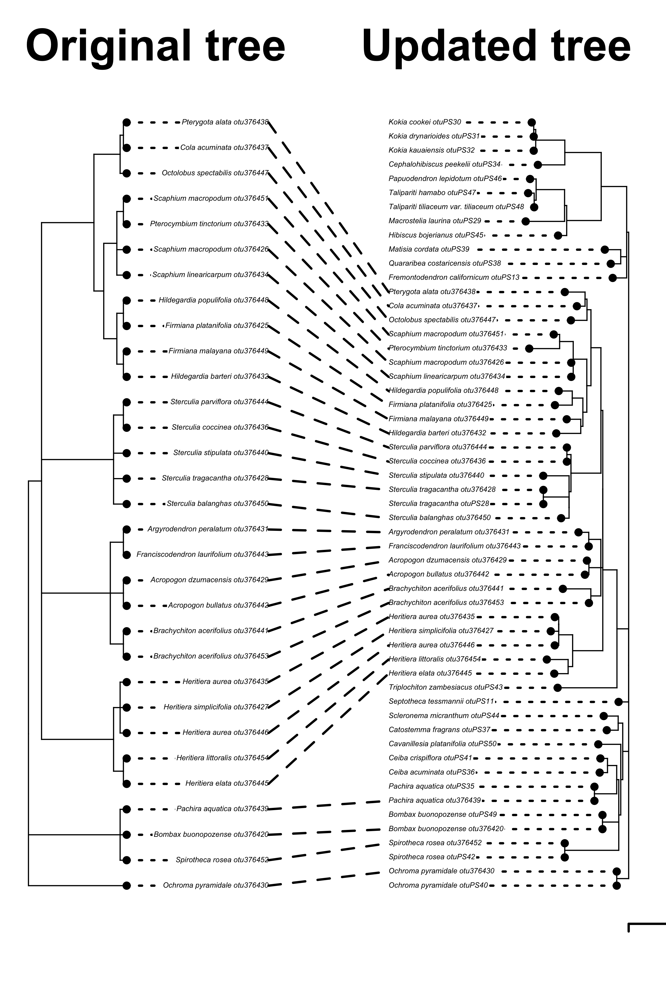

# Introduction

Phylogenetic estimates of evolutionary relationships capture the shared history of living organisms, and provide key context for all our biological observations.
Public biological databases constitute an amazing resource for evolutionary estimation, but a large portion of molecular data publicly available has never been incorporated into any phylogenetic estimate.

GenBank, the USA National Center for Biodiversity Information (NCBI) molecular database, release number 159 (April 15, 2007) hosted 72 million DNA sequences that were gauged to have the potential to resolve phylogenetic relationships of most of its 241 000 distinct taxa [about `r round(236023/240708, digits=4)*100`% of taxa in the NCBI taxonomy release 159; @sanderson2008phylota].
Currently, estimates of phylogenetic relationships are publicly available for about 100 000 taxa only [@piel2009treebase; @hinchliff2015synthesis; @opentreeoflife2019synth], representing less than half of the taxonomic diversity with phylogenetically informative sequence data available in GenBank more than a decade ago.

The discrepancy between molecular data availability and phylogenetic estimates can be partially explained by the many phylogenies that are generated and published and not shared publicly in an accesible way [@drew2013lost; @magee2014dawn; @mctavish2018bioessay]. However, there is also a lag between the amount of new DNA data generated and the analysis of these data in a phylogenetic context.

We address this gap by extending existing phylogenetic estimates with publicly available sequence data.  By using a starting tree and single locus alignment, Physcraper, takes advantage of existing research, and extends trees using loci that taxon specialists have assessed and deemed appropriate for the phylogenetic scope.
The sequences added in the search are limited to a user specified taxon or monophyletic group, or within the taxonomic scope of the in-group of the starting tree.
These automated trees can provide a quick inference of potential relationships, of problems in the taxonomic assignments of sequences, and flag areas of potential systematic interest.

Physcraper leverages public phylogenetic data stored in Open Tree of Life and in TreeBase.
The Open Tree of Life (OpenTree from now on https://opentreeoflife.github.io/) is a project that unites phylogenetic inferences and taxonomy to provide a synthetic estimate of species relationships across the entire tree of life.
OpenTree aims to construct a comprehensive, dynamic and digitally-available tree of life by synthesizing published phylogenetic trees along with taxonomic data.
This "synthetic" tree comprises 2.3 million tips, of which around 90,000 of those taxa are represented by phylogenetic estimates - the rest are placed in the tree based on their taxonomic names.

The Open Tree of Life data store, the [Phylesystem](https://academic.oup.com/bioinformatics/article/31/17/2794/183373), contains more than 4,500 phylogenetic trees from published studies.
The tips in these trees are mapped to a unified taxonomy, which makes these data searchable in a phylogenetically explicit way.
This provides a resource for finding existing estimates of phylogenetic relationships,
and assessing which regions of the tree of life are lacking available phylogenetic estimates.

By linking molecular data, available from databases such as the GenBank [@benson2000genbank; @wheeler2000database], to alignments and phylogenies, available in
the TreeBASE repository [@piel2009treebase] and OpenTree's Phylesystem, we can place new biological data in an evolutionary context.

ARGUMENT - GENES ARE STILL USEFUL IN THE GENOMICS ERA, AND HERE'S WHY:
GENOMIC MARKERS SUCH AS RADSEQ, SNP, MISCROSATS AND UCES - ARE HOMOLOGY HYPOTHESIS THE SAME ON THESE MARKERS THAN FOR PROTEIN CODING AND NON CODING LOCI?
WHAT ARE THE PROS AND CONS OF USING GENE ALIGNMENTS ONLY AND NOT GENOMIC MARKERS?
Martha: Genomic data is not available for a large number of taxa.
While the focus on single locus and gene sequence alignments could appear backwards-looking, in the age of genomics, single locus data has a lot to offer phylogenetics.
One major challenge of inferring phylogenies from genome scale data is inference of homology, and acquiring homologous data across divergent species.
Different research questions call for on different approaches to genomic sequencing, from whole genomes, to transcriptomes, to RadSeq, SNP, mirosats and UCE's.
This variety of approaches results in non-overlapping data sets across taxa.
Even when the same sequencing approach is applied, such as RadSeq, phylogenetic distance can cause allelic dropout at deeper divergences [@eaton2016misconceptions]
In contrast, single locus sequencing generates homologous data across large phylogenetic scales.


Indeed, some systematics support a classic phylogenetics approach (few markers thoughtfully curated) over the genomics approach (a massive amount of DNA markers that will overcome potential errors in the alignment coming from a lack of human curation).
Species tree reconstructions from multi-gene data sets taking into account the multispecies coalescent model are considered the gold standard for inferring species relationships [@song2012resolving; ROJAS ET AL. bats paper, take citations from there].
It has also been suggested that manual curation of locus alignments produces better phylogenetic reconstructions and this has been demonstrated for genomic alignments [@fragoso2017pilot].

A way to incorporate the best of two worlds (massive amounts of newly released molecular data AND fine-grained curation from human experts) is to rely on published manually curated homology hypotheses as "jump-start" alignments [@morrison2006multiple]. This expert-curated alignments can be continuously enriched and updated by incorporating newly released data from public molecular databases.

In leveraging existing homology statements in the form of alignments, this approach differs from existing approaches that automatize the assembly of DNA alignments from the GenBank database for phylogenetic reconstruction ("phylogenetic pipelines") such as PHYLOTA [@sanderson2008phylota], PHLAWD [@smith2009mega], and SUPERSMART [@antonelli2017toward].
Physcraper shares a similar conceptual framework to Pumper [@izquierdo2014pumper], but that software is not currently supported or developed (*or runnable at all honestly...*)

Data input availability:
As of April 2014, the TreeBASE repository hosted about 8 200 curated alignments, providing information on evolutionary relationships of around 100 000 distinct taxa [(see TreeBASE's website about)](https://www.treebase.org/treebase-web/home.html#:~:text=TreeBASE%20is%20produced%20and%20governed,mapped%20to%20104%2C593%20distinct%20taxa.).
This database provides an untapped source of valuable expert knowledge with the potential to update phylogenetic relationships in several different regions of the tree of life.

The Phylesystem (OpenTree's datastore) [@mctavish2015phylesystem] automatically incorporates phylogenies from TreeBASE, and saves metadata linking the original tree to its corresponding alignment repository in TreeBASE. If there are multiple alignments, TreeBASE does not always indicate how they were used to generate the tree. This provides a loose means of linking the tree with the exact alignment that generated it.

Often, linking data in an original alignment with its corresponding phylogeny has to be done by a human curator.
Moreover, different data repositories follow different systems for taxon and study identification, posing a real challenge to automatically link data from across databases that belong to the same taxon and study.
OpenTree's metadata system incorporates taxon identifiers from a variety of taxonomies and repositories, including the NCBI taxonomy, GBIF, etc., MORE EXAMPLES OF DATABASES providing a way to automatically link data from different databases.

Physcraper is a Python encoded pipeline designed to update previously known phylogenetic relationships in a continuous manner, by connecting phylogenies stored in the OpenTree Phylesystem with alignments from TreeBASE and newly released DNA data from GenBank, by using the OpenTree metadata system to connect independent databases through their unique taxon identifiers, automatizing taxonomic name matching across them.
<!-- WE COULD EXPLAIN WHY PYTHON IS BEST FOR THIS: does it help with interoperability? It is flexible enough?
Maybe not relevant for now, so we'll keep it out-->
By design, this approach focuses on data interoperability. By automating taxonomic name matching across NCBI, OpenTree, GBIF and virtually any biological database, users can perform downstream analyses straightforwardly.
For example, it automatizes and standardizes comparison of phylogenetic hypotheses with currently known relationships from the synthetic Open Tree of Life, the Open Tree of Life taxonomy tree and any phylogeny that is stored in the
Phylesystem.

We propose Physcraper as a tool to make data connections across biological databases in a phylogenetic context for the advantage of phylogenetics and comparative biology, as well as an effort towards establishing fully reproducible workflows in phylogenetics.


# The Physcraper framework

```{r framework, echo=FALSE, fig.cap="The Physcraper software is fully described on its documentation website at [physcraper.readthedocs.io](https://physcraper.readthedocs.io/en/latest/), along with installation instructions, tutorials, examples and function usage documentation.", out.width = '85%', fig.retina= 2, fig.align = "center"}
# knitr::include_graphics("https://raw.githubusercontent.com/McTavishLab/physcraper/pyopensci/docs/img/schematic.svg")
knitr::include_graphics("docs/figs/schematic.pdf")
```


The general Physcraper framework is shown in Figure \@ref(fig:framework). Next, we will describe the technical details of each step of the workflow.

## The inputs: a tree and an alignment

- In order to take advantage of the OpenTree tools, it is reccommended that the input tree is either stored in the
  OpenTree [Phylesystem](https://github.com/opentreeoflife/phylesystem), or submitted via OpenTree's curator [application](https://tree.opentreeoflife.org/curator) [@mctavish2015phylesystem]. If the user is not ready to make the input tree public, tree tip labels must be standardized to the unified OpenTree taxonomy using the bulk Taxonomic Name Resolution Service [TNRS](https://tree.opentreeoflife.org/curator/tnrs/) tool *Is there a tnrs bulk citation?* **EJM: Nope :/, just the link**. If taxonomic names can't be standardized, their taxonomic information will be excluded for further analysis.
  Mapping tip names to this unified taxonomy saves a set of user defined characteristics
  that are essential for automatizing the phylogeny updating process. The most relevant of these is the standardization of taxonomic names and the definition of ingroup and outgroup taxa, allowing to automatically set the root for the updated tree on the final steps of the pipeline. Currently, only trees connected to a published study can be stored in the Phylesystem.
  <!-- Discussion: (although there are plans to allow storage of unpublished trees). -->
  Users can choose from among the `r tryCatch({rotl::tol_about()$num_source_trees}, error = function(e) {1216})` published trees supporting the resolved nodes of the synthetic tree in the OpenTree website ([See OpenTree's website about](https://tree.opentreeoflife.org/about/synthesis-release/v12.3)). *MK suggests that WE SHOULD ACTUALLY SAY HERE HOW MANY OPENTREE TREES HAVE ALIGNMENT DATA FROM TREEBASE, I think it's a good idea* 
  **EJM: Currently 2950 studies have treebase data links. It is possible that some/many of these have multiple trees in them, but that is harder to count.**
- The input alignment should be a single locus alignment that was used to generate the tree. Alignments are often stored in a public repository such as TreeBase [@piel2009treebase; @vos2012nexml],
  DRYAD ([www.datadryad.org](http://datadryad.org/)), or a data repository associated with the journal where the tree was originally published.
  If the alignment is stored in TreeBase, Physcraper downloads it directly,
  either from the TreeBASE website ([www.treebase.org](https://treebase.org/))
  or through the TreeBASE GitHub repository (SuperTreeBASE; [github.com/TreeBASE/supertreebase](https://github.com/TreeBASE/supertreebase)).
  If the alignment is on another repository, or constitutes personal data, a path to a local copy of the alignment has to be provided.
- When dealing with single locus alignments, it is sometimes alignments to have fewer taxa than a tree interfered from concatenated data, simply because a single molecular marker usually does not cover all the taxa included in the phylogenetic analysis. Physcraper prunes the input tree to taxa found in the alignment, and verifies that all taxon names on the tips of the tree are in the DNA character matrix and vice versa. Technically, just one taxon name (and its corresponding sequence in the alignment) is needed to continue the algorithm. See next section. *MK mentioned that nothing shoul be dropped here bc the name standardization should have matched everything, so I explained a bit more what this step is. It is not an unmatched taxa pruning but more of an absent taxa pruning. Also, taxa that are not matched should be dropped before right?*
- A summary "csv" file with the results from the taxon name standardization and pruning is produced for the user.
- The standardized and pruned tree and alignment (checked tree and alignment from now on) are output as "newick" and "fasta" respectively in the "inputs" folder to be used in the following steps.

## DNA sequence search and filtering

- Physcraper uses the GenBank DNA database as source to search for new sequences. The DNA sequence search can be performed on the GenBank remote database or in a GenBank local database set up by the user, which can speed up the search process. Detailed instructions to setup a local database are provided on Physcraper's software documentation.
<!-- Alternative DNA molecular databases could be used for this purpose, either personal or public databases, such as the European Nucleotide Archive or the DNA DataBank of Japan. The code to do this with Physcraper is not yet implemented. -->

- The next step is to identify a "search taxon" to constrain the sequence search on the GenBank database within that taxonomic group.
  The search taxon can be chosen by the user from the NCBI taxonomy.
  If none is provided, then the search taxon is automatically set using the taxa in the input tree labeled as the 'ingroup'.
  The search taxon is The Most Recent Common Ancestor (MRCA) of the ingroup taxa in the OpenTree synthetic tree, that is also a named clade in the NCBI taxonomy.
  <!-- FIGURE RECOMMENDED: Figure \@ref(fig:search)  -->
  This is known in the OpenTree as the Most Recent Common
  Ancestral Taxon (MRCAT; also referred as the Least Inclusive Common Ancestral taxon - LICA) *I looked for a citation but it seems that it is a concept used on the open tree of life API wikis only*.
  The MRCAT can be different from the phylogenetic MRCA when the latter is an unnamed clade in the synthetic tree.
  To identify the MRCAT of a group of taxon names, we use the OpenTree [taxonomic tool v3](<https://github.com/OpenTreeOfLife/germinator/wiki/Taxonomy-API-v3#mrca>) [@rees2017automated].

  Users can provide a search taxon that is either a more or a less inclusive
  clade relative to the ingroup of the original phylogeny. If the search taxon is more inclusive, the sequence search will be performed outside the MRCAT of the matched taxa, e.g., including all taxa within
  the family or the order that the ingroup belongs to. If the search taxon is a less inclusive clade, the users can focus on enriching a particular clade/region within the ingroup of the phylogeny.
- The Basic Local Alignment Search Tool, BLAST [@altschul1990basic; @altschul1997gapped] is used to identify
  similarity between DNA sequences within the search taxon in a nucleotide
  database, and the sequences on the checked alignment.
  The `blastn` function from the BLAST command line tools [@camacho2009blast] is used for local database sequence searches.
  For remote database searches, we modified the BioPython [@cock2009biopython] BLAST function from the [NCBIWWW module](https://biopython.org/DIST/docs/api/Bio.Blast.NCBIWWW-module.html) to accept an alternative BLAST address (URL). This is useful when a user has no access to the computer capacity needed to setup a local database, and a local blast database can be set up on a remote machine to BLAST avoiding NCBI's required wait times, which slow down the searches markedly.
  *MK suggest explaining here what the ncbi waiting times are, but I don;t think it's needed, what do you think?*
  <!--***How does the blast is setup? Is it an all-blast-all??***-->
   **EJM: I think your next section answers the balst set up q nicely**
- A constrained BLAST search is performed, in which each sequence
  in the alignment is BLASTed once against all database DNA sequences belonging to the search
  taxon. All results from each BLAST run are stored, and sequences with match scores better than the e-value cutoff (default to 0.00001) are saved
  along with their corresponding metadata, i.e., their GenBank accession number.
  The full sequence for each match is downloaded from NCBI into a dedicated library within the "physcraper" folder, allowing for secondary analyses to run significantly faster.
- BLAST result sequences will be discarded if they fall outside the user set min and max length cutoffs, set as proportions of the average length without gaps of sequences in the input alignment(defaults values of 80% and 120%, respectively).
  This filtering guarantees the exclusion of whole genome sequences, which create problems in multiple sequence alignment.
  The GenBank accession numbers of sequences removed to due to not meeting e-value or length cutoffs are stored in outputfiles.
- All accepted sequences up to this point are assigned an internal identifier, and are further filtered.
- New sequences that are identical to existing sequences, or to subsets of an existing sequence are discarded, unless they represent a different taxon than the existing sequence *MK mentioned it was unclear to her if this was an NCBI or OTT taxon. I think it is the unified taxonomy, hence an OTT taxon? I think it doesn't harm to be super explicit about it*.
**EJM: It checks using the OTT taxonomy, but it practice OpenTree doesn't merge ncbi taxa, so it is both/either**
Longer sequences belonging to the same taxon as the original sequence will be considered further for analysis.
- Among the filtered sequences, there are often several representatives per taxon.
  Although it can be useful to keep some of them, for example, to investigate monophyly
  within species, there can be hundreds of exemplar sequences per taxon for some markers.
  To control the number of sequences per taxon in downstream analyses,
  5 sequences per taxon are chosen at random. This number is set by default but can be modified by the user.
- All BLAST and filtering parameters can be customized by the user.
- Reverse, complement, and reverse-complement BLAST result sequences are identified and translated using BioPython internal functions [@cock2009biopython].
- Iterative cycles of sequence similarity search can be performed, by blasting the newly found sequences until no new sequences are found. By default only one BLAST search cycle is performed in which only sequences in the processed original alignment are blasted.
- New sequences passing all filtering steps are added to the "csv" taxon summary file.
- A "fasta" file containing all new filtered and processed sequences resulting from the BLAST search is generated for the user, and is used as an input for alignment.

## New DNA sequence alignment

- By default, Physcraper uses the software MUSCLE [@edgar2004muscle] to perform DNA sequence alignments. Instructions on how to install all software dependencies used by Physcraper are provided in the documentation.
- The process to align new sequences consists of two steps. First, all new sequences are aligned using the default MUSCLE options.
- Second, a MUSCLE profile alignment is performed, in which the original alignment
  is used as a template to align the new sequences. This ensures that the final alignment
  follows the homology criteria established by the original alignment.
- The final alignment is not further processed by Physcraper. It is recommended that the alignment is checked by the user, by eye followed by manual refinement, or using a tool for automatic alignment processing [@castresana2000selection; @castresana2002gblocks].
- While curating the alignment is a critical step, it is not a reproducible one. The main reason for its lack of reproducibility might be that it is hard to track changes made on the alignment. A form of version control, to register the differences between the alignment that was produced by the software and the manually curated alignment will be ideal. 
- Users may also use Physcraper to only gather new GenBank sequences, to then apply their own preferred alignment and phylogenetic inference methods.

## Tree reconstruction and comparison

- A Maximum Likelihood (ML) gene tree is reconstructed for each alignment provided, using the software RAxML [@stamatakis2014raxml] with default settings, such as a GTRCAT model of molecular evolution and 100 bootstrap replicates with the default algorithm. Currently only the number of bootsrap replicates can be specified by the user.
- By default, the original tree is used as a starting tree for the ML searches. Alternatively, users can set the original tree as a full topological constraint, or ignore it completely for the searches.
- Bootstrap results are summarized with the SumTrees module of DendroPy [current version 4.4.0; @sukumaran2010dendropy].
- Physcraper's final result is an updated phylogenetic hypothesis for the gene provided in the input alignment.
- Tips on all trees generated by Physcraper are defined by a taxon "name space". The taxon metadat captures the NCBI accession information, as well as the taxon identifiers, allowing the user to perform comparisons and conflict analyses.
- Two ways to compare the updated tree with the original tree are implemented in Physcraper. First, Robinson Foulds weighted and unweighted metrics are estimated using Dendropy functions [@sukumaran2010dendropy].
- Second, a conflict analysis is performed. This is a node by node comparison between the the synthetic OpenTree and the original and updated tree individually. This is performed with OpenTree's conflict Application Programming Interface [@redelings2017supertree].
- For the conflict analysis to be meaningful, the root of the tree needs to be accurately defined.
- A suggested default rooting based on OpenTree's taxonomy is implemented for now. This approach uses the taxon labels for all the tips in the updated tree, pulls an inferred subtree from OpenTree's taxonomy and then applies the same rooting to the inferred updated tree. However, if the updated tree changes expectations from taxonomy, the root may no longer be appropriate. Automatic identification of a phylogenetic tree root is indeed a difficult problem that has not been solved yet. The best way right now is for users to define outgroup directly on the updated tree, so trees are accurately rooted. *It would be a nice addiion to have users give the output of the input tree as an argument at some point, or maybe we could add a super outgroup at random based on the search taxon*


# Examples

We will illustrate the utility of Physcraper in here with two use-case scenarios. One in which the user is interested in a particular group. Another one in which the user is interested in a particular phylogeny.
A tutorial as well as illustrated examples of commands for every step needed to perform a Physcraper analysis are available elsewhere.

## The hollies

A student is interested in the genus *Ilex*, the only extant clade within the family Aquifoliaceae, order Aquifoliales of flowering plants.
The genus encompasses between 400-600 living species. A review of literature (google scholar search for "ilex phylogeny") reveals that there are several published phylogenetic trees showing relationships within the hollies [@cuenoud2000molecular; @manen2010history; @setoguchi2000intersectional; @selbach2009new], but only two have their data available publicly [@gottlieb2005molecular; @yao2020phylogeny].
@gottlieb2005molecular made tree and alignment data available in TreeBASE. The tree sampling 48 species was integrated to the OpenTree Phylesystem and is part of OpenTree's synthetic tree.
<!-- The second tree has not been made available anywhere, not even in the supplementary data of the original publication. -->
The most recent *Ilex* tree from @yao2020phylogeny has been made available in the OpenTree Phylesystem and in the DRYAD repository. It is the best sampled yet for the genus, with 200 species. However, it has not been added to OpenTree's synthtetic tree yet.
This makes it a perfect case to test the basic functionalities of Physcraper: we know that the sequences of the most recently published tree have been made available on the GenBank database. Hence, we expect that updating the oldest tree should at least contain the same species sampled in the largest tree.

DESCRIBE RESULTS: SUMMARY OF NEW TAXA FOUND RELATIVE TO ORIGINAL TREE AND RELATIVE TO OpenTree
RF DISTANCE INTERPRETATION
HOW MUCH TIME THE BLAST RUN TOOK
ML ESTIMATES OF UPDATED TREE VS ORIGINAL TREE

FIGURE: FACE TO FACE ORIGINAL VS UPDATED PHYLOGENY, IN RED NEW TAXA NOT IN OpenTree.


## The Malvaceae

A postdoc started working with a new reserach group. They are interested in solving relationships among lineages of the Malvaceae, a family of flowering plants with almost 6 000 known species, containing the relatives of cacao, cotton, durian and okra.
A review of the literature shows them that there are many phylogenetic trees encompassing some of the linegaes in the group. However, the head of the research group wants to use a particular marker they believe to be the best one to be able to solve the relationships in the group. They have been working on the alignment for a long time and they want to incorporate new data into the hypothesis of homology that they have been curating and that they trust.

<!-- ```{bash echo= FALSE, include=FALSE, message= FALSE, results='hide'}
wget "https://raw.githubusercontent.com/McTavishLab/physcraperex/master/data-raw/malvaceae-images/cotree-plot2-1.png"
mv cotree-plot2-1.png docs/figs/cotree-plot2-1.png
``` -->
```{r malvaceae, echo=FALSE, fig.cap="Comparison of original tree and tree updated with Physcraper, family Malvaceae.", out.width = '85%', fig.retina= 2, fig.align = "center"}

```
\newpage

# Discussion

Data repositories hold even more information than meets the eye.
Besides the actual data, they are rich sources of metadata that can be used for the advantage of all areas of biology as well as the advancement of scientific policy and applications.

COMPARE WITH PERFORMANCE OF OTHER PIPELINES FOR SEQUENCE SCRAPING
WHY WE DID NOT MAKE A BENCHMARK COMPARISON


Many pipelines are making use of DNA data repositories in different ways.
Most of them focus on efficient ways to mine the data -- getting the most homologs.
Some focus on accurate ways of mining the data -- getting real and clean homologs.
Others focus on refining the alignment.
Most focus on generating full trees *de novo*, mainly for regions of the Tree of
Life that have no phylogenetic assessment yet in published studies, but also for
regions that have already been studied and which have phylogenetic data.
However, expert phylogenetic knowledge is also an important source of data in public
and open repositories that is not being used to its full potential.


All these tools are key efforts for advancing towards reproducibility in phylogenetics,
a field that has relied on processes which are somewhat artisanal.
Here, we highlight the potential of taking advantage of this careful curation work in previous phylogenetic estimates. By taking sources of information available from data repositories and present a method to link data from different repositories, while leveraging the knowledge and intuition of the expert
community to build up our phylogenetic knowledge, we can use not only data accumulated in
molecular data repositories, but phylogenetic knowledge accumulated in phylogenetic tree repositories.

While not generating full phylogenies *de novo*, Physcraper is still capable of generating new phylogenetic knowledge.
Moreover, it can combine phylogenies with data from repositories other than molecular data. For example geographic locations (using GBIF ids), fossils (using PBDB ids), etc. *from Robert: I think you can sell the program more here. Why is it better than the other methods? You mentioned in lab meeting that its difficult to run other programs, talk about that here, talk about the speed and other advantages*

Physcraper has the potential to be applied for the advantage of the field to rapidly *HOW FAST IS "RAPID" mention it in results and then here again*
place newly discovered species phylogenetically [@webb2010biodiversity],
obtain trees for ecophylogenetic studies [@helmus2012phylogenetic],
help to systematize molecular databases, i.e., curate taxonomic assignations [@san2010molecular],
and rapidly generate custom species trees for downstream analyses [@stoltzfus2013phylotastic].


# Acknowledgements

Research was supported by the grant "Sustaining the Open Tree of Life", National Science Foundation ABI No. 1759838, and ABI No. 1759846.
Compute time was provided by the Multi-Environment Research Computer for Exploration and Discovery (MERCED) cluster from the University of California, Merced (UCM), supported by the NSF Grant No. ACI-1429783.

We thank members of the "short bar" Science and Engineering Building 1, UCM, joint lab paper discussion meeting for valuable comments on a first version of this manuscript.


# Authors' Contributions

EJM: Conceived study, wrote most of the code, documentation and tests.
MK: Wrote code for ncbidataparser module, filtering of sequences per OTU and using offline blast searches, wrote documentation and tests.
LLSR: Wrote the manuscript, alignment code, documentation, performed analyses and developed examples.
All authors contributed to the manuscript.

# Data Avilability

\newpage
# References
