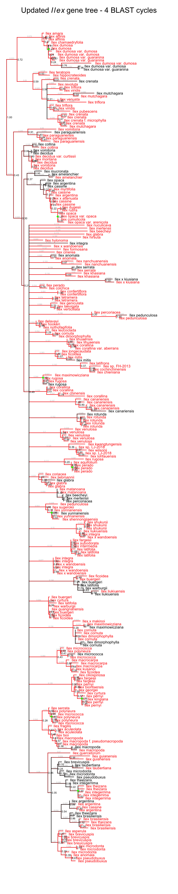
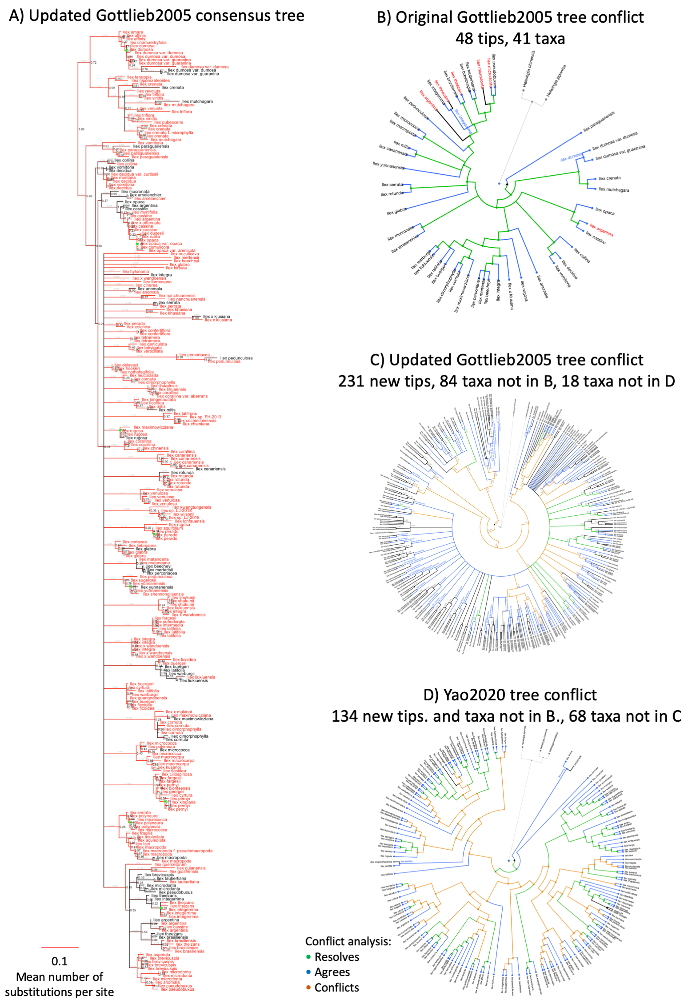

# Introduction

Phylogenetic estimates of evolutionary relationships capture the shared history of living organisms, and provide key context for all our biological observations.
Public biological databases constitute an amazing resource for evolutionary estimation, but a large portion of molecular data publicly available has never been incorporated into any phylogenetic estimate. Extending existing phylogenetic estimates with new DNA sequence data, geographical location, and other metadata in a reproducible and continuous manner is possible by automating connections between biological databases. Here, we introduce Physcraper, a tool that uses existing phylogenetic research from public biological databases to update a starting tree and single locus alignments, to build upon molecular data that taxon specialists have assessed and deemed appropriate for a specific phylogenetic scope.

The prevalence of taxonomic idiosyncrasies across databases represent a key challenge to automatically connecting data from disparate biological databases in a phylogenetic context. To standardize taxonomic names, a unified system is needed. The main aim of the Open Tree of Life project (OpenTree)
<!-- [project](https://opentreeoflife.github.io/)  -->
is to construct a comprehensive, dynamic and digitally-available tree of life by synthesizing published phylogenetic trees along with taxonomic data. Currently, OpenTree's "synthetic" tree comprises 2.3 million tips, of which around 90,000 are represented by phylogenetic estimates - the remaining 1.4 million taxa are placed in the tree based on their taxonomic assignment. To achieve this, OpenTree unifies taxonomy from various databases [@rees2017automated] such as the USA National Center for Biodiversity Information (NCBI) molecular database GenBank [@benson2000genbank; @wheeler2000database], the Global Biodiversity Information Facility [GBIF; @secretariat2017gbif], and the World Register of Marine Species [WoRMS; www.marinespecies.org/], providing a key resource that can be used to connect data from virtually any biological database to phylogenetic data that has been standardized to OpenTree's unified taxonomy.

Another challenge to incorporating molecular data from public databases to update phylogenetic knowledge is assembling high-quality homology hypotheses.
Species tree reconstructions from multiple single locus data sets taking into account the multispecies coalescent model are seen as the gold standard for inferring species relationships [@song2012resolving].
Genomics has, and will continue to, revolutionize phylogenetic inference.
Yet, different research questions call for different genomic sequencing approaches, from whole genomes, to transcriptomes, restriction-site associated DNA sequencing, single nucleotide polymorphisms, microsatellites, and ultra-conserved elements, which has lead to largely non-overlapping genomic data sets across taxa, creating difficulty in wide scale phylogenetic reconstructions.
<!-- Also, as @andermann2020guide point out, "assembling full genomes is often unnecessary for phylogenomic studies if the main goal is to retrieve an appropriate number of phylogenetically informative characters from several independent and single-copy genetic markers [@jones2016targeted]." -->
While phylogenomics ameliorates the problem of non-overlapping genomic data sets by focusing on targeted capture of informative characters from independent and single-copy genetic markers [@andermann2020guide; @jones2016targeted], decades of single locus sequencing have already generated homologous DNA data sets that can be used for phylogenetic reconstruction at many scales.

Indeed, more than a decade ago, GenBank release number 159 (April 15, 2007) already hosted 72 million DNA sequences. These sequences were gauged to have the potential to resolve phylogenetic relationships of most (`r round(236023/240708, digits=4)*100`%) of the almost 241, 000 distinct taxa in the NCBI taxonomy at the time [@sanderson2008phylota]. Assembling a DNA alignment from such a massive database can be done "by hand", but it requires huge amounts of time and it is mostly a non-reproducible approach. Computational pipelines that make DNA sequence search faster and more efficient, as well as more reproducible, have been applied to study evolutionary relationships among a variety of organisms [e.g., @smith2009mega; @antonelli2017toward; @izquierdo2014pumper].
<!-- *maybe a box of all pipelines?* -->
However, even in phylogenomic reconstructions, thoughtfully curated markers and alignments can improve phylogenetic reconstructions [@fragoso2017pilot].

A way to incorporate the best of two worlds (massive amounts of newly released molecular data and fine-grained curation from human experts) is to rely on published manually curated homology hypotheses as "jump-start" alignments [@morrison2006multiple]. The TreeBASE database [@piel2009treebase] hosts about 8, 200 publicly accessible alignments, providing information on evolutionary relationships of around 100, 000 distinct taxa [(see TreeBASE's website about)](https://www.treebase.org/treebase-web/home.html#:~:text=TreeBASE%20is%20produced%20and%20governed,mapped%20to%20104%2C593%20distinct%20taxa.), representing a source of valuable expert knowledge. Linking published alignments with public molecular data that has not yet been included in any public phylogenetic estimate, has the potential to accelerate the enrichment and updating of phylogenetic relationships in many regions of the tree of life. The phylogenies associated with TreeBASE alignments have been integrated to the OpenTree's datastore, the Phylesystem [@mctavish2015phylesystem], and metadata linking them to their corresponding alignment repository is available, providing a non-automated way of linking trees with the alignment that generated them.


Physcraper relies on programmatic access protocols (API's) available to automatically link molecular data from GenBank to alignments from TreeBASE and phylogenies from OpenTree's Phylesystem, to continually update and enrich phylogenetic knowledge based on expertly-curated homology hypotheses. Physcraper also provides new types of access to various general OpenTree programmatic tools for comparison of existing phylogenetic hypotheses with newly generated ones.
Physcraper is coded as a Python pipeline that focuses on data interoperability, by integrating taxonomic name matching across biological databases. This integration also allows users to rapidly place new data from a diverse range of biological databases in an evolutionary context, making a variety of downstream analyses straightforward.


# The Physcraper framework

```{r framework, echo=FALSE, fig.cap="The Physcraper framework consists of 4 steps (see text). The software is fully described on its documentation website at physcraper.readthedocs.io, along with installation instructions, function usage descriptions, examples and tutorials.", out.width = '85%', fig.retina= 2, fig.align = "center"}
# knitr::include_graphics("https://raw.githubusercontent.com/McTavishLab/physcraper/pyopensci/docs/img/schematic.svg")
knitr::include_graphics("docs/figs/schematic.pdf")
```

The general Physcraper framework is depicted in Figure \@ref(fig:framework). Briefly, it consists of 4 steps: 1) identifying and processing a phylogenetic tree to update and its underlying alignment; 2) performing a constrained BLAST search of sequences from the original alignment on the GenBank DNA database, and filtering of newly found sequences; 3) profile-aligning new sequences that passed the filtering to the original alignment; 4) performing a phylogenetic analysis and comparing the updated tree to previous phylogenetic estimates in the focus group. Next, we will describe technical details for each step.

## The inputs: a tree and an alignment

In order to take advantage of the OpenTree tools, it is reccommended that the input tree is either stored in the
  OpenTree [Phylesystem](https://github.com/opentreeoflife/phylesystem), or submitted via OpenTree's curator [application](https://tree.opentreeoflife.org/curator) [@mctavish2015phylesystem].
  Currently, only trees connected to a published study can be stored in the Phylesystem.
  Users can choose from among the 2, 950 studies in OpenTree's Phylesystem that have alignments on TreeBASE.
  If the user is not ready to make the input tree public, tree tip labels can be standardized to the unified OpenTree taxonomy using OpenTree's bulk Taxonomic Name Resolution Service [TNRS](https://tree.opentreeoflife.org/curator/tnrs/) tool.
  This step is referred to as taxonomic name mapping and Phylesystem stored trees are processed in this way upon submission.
  Physcraper saves a summary "csv" file with results from the taxon name standardization for advantage of the user, including the mappings to unique identifiers in the OpenTree and NCBI taxonomies.
  If taxon names can't be mapped, their taxonomic information is not used in comparison analysis. These taxa will still be used in the sequence search and phylogenetic reconstruction steps.
  Mapping tip names to OpenTree's unified taxonomy saves a set of user defined characteristics
  that are essential for automatizing the phylogeny updating process. The most relevant of these is the standardized taxonomic names and the definition of ingroup and outgroup taxa, allowing to automatically set the root for the updated tree on the final steps of the pipeline.

The input alignment should be a single locus alignment that was used in part or in whole, to generate the tree. Alignments are often stored in a public repository such as TreeBase [@piel2009treebase; @vos2012nexml],
  DRYAD ([www.datadryad.org](http://datadryad.org/)), or a data repository associated with the journal where the tree was originally published.
  If the alignment is stored in TreeBase, Physcraper can download it directly,
  either from the TreeBASE website ([www.treebase.org](https://treebase.org/))
  or through the TreeBASE GitHub repository (SuperTreeBASE; [github.com/TreeBASE/supertreebase](https://github.com/TreeBASE/supertreebase)).
  If the alignment is on another repository, or constitutes personal data, a path to a local copy of the alignment has to be provided.

Single locus alignments sometimes have fewer taxa than the tree inferred from the full concatenated data, simply because a single molecular marker usually does not cover all the taxa sampled for the full phylogenetic analysis. Physcraper prunes the input tree to taxa found in the alignment, and verifies that all taxon names on the tips of the tree are in the DNA character matrix and vice versa. Technically, just one taxon name (and its corresponding sequence in the alignment) is needed to continue the algorithm.
The standardized and pruned tree and alignment (checked tree and alignment from now on) are output as "newick" and "fasta" respectively in the "inputs" folder to be used in the following steps.

## DNA sequence search and filtering

Physcraper uses the GenBank DNA database as source to search for new sequences. The DNA sequence search can be performed on the GenBank remote database or in a GenBank local database set up by the user, which can speed up the search process. Detailed instructions to setup a local database are provided on Physcraper's software documentation.

The next step is to identify a "search taxon" to constrain the sequence search on the GenBank database within that taxonomic group.
  The search taxon can be chosen by the user from the NCBI taxonomy.
  If none is provided, then the search taxon is automatically set using the taxa in the input tree labeled as the "ingroup" (Fig. \@ref(fig:framework)).
  The search taxon is The Most Recent Common Ancestor (MRCA) of the ingroup taxa in the OpenTree synthetic tree, that is also a named clade in the NCBI taxonomy.
  <!-- FIGURE RECOMMENDED: Figure \@ref(fig:search)  -->
  This is known in the OpenTree as the Most Recent Common
  Ancestral Taxon (MRCAT; also referred as the Least Inclusive Common Ancestral taxon - LICA).
  The MRCAT can be different from the phylogenetic MRCA when the latter is an unnamed clade in the synthetic tree.
  To identify the MRCAT of a group of taxon names, we use the OpenTree [taxonomic tool v3](<https://github.com/OpenTreeOfLife/germinator/wiki/Taxonomy-API-v3#mrca>) [@rees2017automated].

  Users can provide a search taxon that is either a more or a less inclusive
  clade relative to the ingroup of the original phylogeny. If the search taxon is more inclusive, the sequence search will be performed outside the MRCAT of the matched taxa, e.g., including all taxa within
  the family or the order that the ingroup belongs to. If the search taxon is a less inclusive clade, the users can focus on enriching a particular clade/region within the ingroup of the phylogeny.

The Basic Local Alignment Search Tool, BLAST [@altschul1990basic; @altschul1997gapped] is used to identify
  similarity between DNA sequences within the search taxon in a nucleotide
  database, and the sequences on the checked alignment.
  The `blastn` function from the BLAST command line tools [@camacho2009blast] is used for local database sequence searches.
  For remote database searches, we modified the BioPython [@cock2009biopython] BLAST function from the [NCBIWWW module](https://biopython.org/DIST/docs/api/Bio.Blast.NCBIWWW-module.html) to accept an alternative BLAST address (URL). This is useful when a user has no access to the computer capacity needed to setup a local database, and a local blast database can be set up on a remote machine to BLAST avoiding NCBI's required waiting times, which slow down the searches markedly.
A constrained BLAST search is performed, in which each sequence
  in the alignment is BLASTed once against all database DNA sequences belonging to the search
  taxon. All results from each BLAST run are stored, and sequences with match scores better than the e-value cutoff (default to 0.00001) are saved
  along with their corresponding metadata, i.e., their GenBank accession number.
  The full sequence for each match is downloaded from NCBI into a dedicated library within the "physcraper" folder, allowing for secondary analyses to run significantly faster.

BLAST result sequences will be discarded if they fall outside the user set min and max length cutoffs, set as proportions of the average length without gaps of sequences in the input alignment (defaults values of 80% and 120%, respectively).
  This filtering guarantees the exclusion of whole genome sequences, which create problems in multiple sequence alignment.
  The GenBank accession numbers of sequences removed due to not meeting e-value or length cutoffs are stored in output files.
All sequences accepted up to this point are assigned an internal identifier.
New sequences that are either identical or a subset of any existing sequence in the input alignment are discarded, unless they represent a different taxon in the OTT taxonomy or the NCBI taxonomy, or they are longer than the sequence in the input alignment.
Among the filtered sequences, there are often several representatives per taxon.
  Although it can be useful to keep some of them, for example, to investigate monophyly
  within species, there can be hundreds of exemplar sequences per taxon for some markers.
  To control the number of sequences per taxon in downstream analyses,
  5 sequences per taxon are chosen at random. This number is set by default but can be modified by the user.

All BLAST and filtering parameters can be customized by the user.
Reverse, complement, and reverse-complement BLAST result sequences are identified and translated using BioPython internal functions [@cock2009biopython].
Iterative cycles of sequence similarity search can be performed, by blasting the newly found sequences until no new sequences are found. By default only one BLAST search cycle is performed in which only sequences in the input alignment are blasted.
New sequences passing all filtering steps are added to the "csv" taxon summary file.
A "fasta" file containing all new filtered and processed sequences resulting from the BLAST search is generated for the user, and is used as an input for alignment.

## New DNA sequence alignment

By default, Physcraper uses the software MUSCLE [@edgar2004muscle] to perform DNA sequence alignments. Instructions on how to install all software dependencies used by Physcraper are provided in the documentation.
The process to align new sequences consists of two steps. First, all new sequences are aligned using the default MUSCLE options.

Second, a MUSCLE profile alignment is performed, in which the original alignment
  is used as a template to align the new sequences. This ensures that the final alignment
  follows the homology criteria established by the original alignment.
The final alignment is not further processed by Physcraper. It is recommended that the alignment is checked by the user, by eye followed by manual refinement, or using a tool for automatic alignment processing [e.g., GBlocks; @castresana2000selection; @castresana2002gblocks].
While curating the alignment is a critical step, it is not a reproducible one. The main reason for its lack of reproducibility might be that it is hard to track changes made on the alignment. A form of version control, to register the differences between the alignment that was produced by the software and the manually curated alignment would ideal.
Users may also use Physcraper to only gather new GenBank sequences, to then apply their own preferred alignment and phylogenetic inference methods.

## Tree reconstruction and comparison

A Maximum Likelihood (ML) gene tree is reconstructed for each alignment provided, using the software RAxML [@stamatakis2014raxml] with default settings, such as a GTRCAT model of molecular evolution and 100 bootstrap replicates with the default algorithm. Currently only the number of bootsrap replicates can be specified by the user.
By default, the original tree is used as a starting tree for the ML searches. Alternatively, users can set the original tree as a full topological constraint, or ignore it completely for the searches.
Bootstrap results are summarized with the SumTrees module of DendroPy [current version 4.4.0; @sukumaran2010dendropy].

Physcraper's final result is an updated phylogenetic hypothesis for the locus provided in the input alignment.
Tips on all trees generated by Physcraper are defined by a taxon "name space". The taxon metadata captures the NCBI accession information, as well as the taxon identifiers, allowing the user to perform comparisons and conflict analyses.
Two ways to compare the updated tree with the original tree are implemented in Physcraper. First, Robinson Foulds weighted and unweighted metrics are estimated using Dendropy functions [@sukumaran2010dendropy].
Second, a conflict analysis is performed. This is a node by node comparison between the the synthetic OpenTree and the original and updated tree individually. This is performed with OpenTree's conflict Application Programming Interface [@redelings2017supertree].
For the conflict analysis to be meaningful, the root of the tree needs to be accurately defined. A suggested default rooting based on OpenTree's taxonomy is implemented for now. This approach uses the taxon labels for all the tips in the updated tree, pulls an inferred subtree from OpenTree's taxonomy and then applies the same rooting to the inferred updated tree. However, if the updated tree changes expectations from taxonomy, the root may no longer be appropriate. Automatic identification of a phylogenetic tree root is indeed a difficult problem that has not been solved yet. The best way right now is for users to define outgroup directly on the updated tree, so trees are accurately rooted.
<!-- *It would be a nice addition to have users give the output of the input tree as an argument at some point, or maybe we could add a super outgroup at random based on the search taxon* -->


# Example: The hollies

To illustrate the utility of Physcraper we propose a scenario in which a user is interested in phylogenetic relationships within the genus *Ilex*. Commonly known as "hollies", the genus encompasses between 400-700 living species, and is the only extant clade within the family Aquifoliaceae, order Aquifoliales of flowering plants.

An online literature review in June 2020 (google scholar search for "ilex phylogeny") reveals that there are several published phylogenetic trees showing relationships within the hollies [@cuenoud2000molecular; @manen2010history; @setoguchi2000intersectional; @selbach2009new], but only two have their data available publicly [@gottlieb2005molecular; @yao2020phylogeny].
@gottlieb2005molecular made original tree and alignment data available in [TreeBASE](https://treebase.org/treebase-web/search/study/summary.html?id=1091). The "Gottlieb2005" tree sampling 41 species was added to the [OpenTree Phylesystem](https://tree.opentreeoflife.org/curator/study/edit/pg_2827/?tab=home) and its information has been integrated into [OpenTree's synthetic tree](https://devtree.opentreeoflife.org/opentree/opentree12.3@mrcaott68451ott89474/Ilex-theizans--Ilex-dumosa).

The most recent *Ilex* tree from @yao2020phylogeny, has been made available in the [OpenTree Phylesystem](https://tree.opentreeoflife.org/curator/study/view/ot_1984) and in the [DRYAD repository](https://datadryad.org/stash/dataset/doi:10.5061/dryad.k0p2ngf4x). The "Yao2020" tree, is the best sampled phylogenetic tree yet available for the hollies, with 175 tips.
This makes it a great case to highlight the functionalities of Physcraper and assess its limitations.
A tutorial as well as illustrated examples of functions implemented on each step of the analysis are available in Physcraper's documentation website.
Figure \@ref(fig:results) shows results from a Physcraper analysis applied to an alignment of internal transcribed spacer DNA regions (ITS) from @gottlieb2005molecular. Physcraper ran on a local BLAST database, on a laptop Linux computer for 19hrs 45min to perform BLAST and RAxML analyses, with bootstrap analyses taking an additional 13hrs.
The updated Gottlieb2005 tree contains all 41 distinct taxa from the original study plus 231 new tips, contributing phylogenetic data to 84 additional taxa within *Ilex*. The best RaxML tree is 99% resolved, while the consensus tree is 75% resolved, meaning that 25% of nodes have a bootstrap < 0.1, while 48% nodes have bootstrap support > 0.75.
A large portion of internal branches are negligibly small, with 30 branches < 0.00001 substitution rate units, from which only 9 have a bootstrap support > 0.75 (Fig. \@ref(fig:results)).
For comparison, the Yao2020 tree also contains all 41 distinct taxa from the original Gottlieb2005 study,
<!-- has less new tips (134), but  -->
and contributes phylogenetic data to 134 additional taxa within *Ilex*, from which
`r 135-68` are also in the updated Gottlieb2005 tree. @yao2020phylogeny also used ITS as a marker, but their data in GenBank is not public yet, so Physcraper was unable to incorporate 68 additional taxa into the analysis.
When those sequences are available online, repeating the physcraper run will easily incorporate them into the expanded analysis.
The Yao2020 tree also lacks 18 taxa that were added by Physcraper.
<!-- **Any statements about relationships or anything? Are there multiple seqs for these taxa?**
add 1 sentence saying that it is odd that we are getting differnet relationships given what is likely to be the same data
but we can't compare the exact seqs or alignemnt, bc they are not available.
 -->
This might be caused by the method they used to download existing ITS *Ilex* sequences from GenBank, which is not fully explained in the publication.
  Other examples of Physcraper runs on empirical data at a range of taxonomic scales are available in the Physcraper documentation online.
<!-- The alignments have THIS MANY columns and THIS AMOUNT of missing data. -->
<!-- RF DISTANCE INTERPRETATION -->
<!-- ADD ML ESTIMATES OF UPDATED TREE VS ORIGINAL TREE ?-->

<!-- ```{bash echo= FALSE, include=FALSE, message= FALSE, results='hide'}
wget -O docs/figs/ilex-plot-tips-and-branches-1.png https://raw.githubusercontent.com/McTavishLab/physcraperex/master/docs/articles/ilex_files/figure-html/plot-tips-and-branches-1.png
``` -->

```{r results, echo=FALSE, fig.cap="A) Phylogenetic tree obtained by updating the Gottlieb et al. 2005 tree in B) using Physcraper.", out.width = '100%', fig.retina= 2}

# 


```


\newpage

*Figure \@ref(fig:results) caption continued*: Tips in original alignment and new tips added with Physcraper are depicted in black and red, respectively. Physcraper obtained sequences from the GenBank database via local BLAST of all sequences in the original alignment that generated tree in B), filtered them following criteria specified in section "DNA sequence search and filtering", aligned them to the original alignment using MUSCLE and performed a phylogenetic reconstruction using RAxML with 100 bootstraps. B-D show results of the conflict analysis performed with OpenTree tools.


# Discussion

Data repositories designed to preserve and democratize access to biological data
constitute an essential resource for evolutionary estimation. While data keep accumulating,
our ability to reanalyze and incorporate new data with available knowledge is being challenged.

Various phylogenetic pipelines have been designed to make evolutionary sense of the vast amount of public molecular data available in different ways.
Pipelines like Phylota [@sanderson2008phylota], PyPHLAWD [@smith2009mega], and SUPERSMART [@antonelli2017toward]
focus mainly on generating full trees *de novo* (i.e., inferring phylogenetic relationships from a newly generated homology hypothesis, as opposed to e.g., supertrees, that are generated by assembling previous phylogenetic estimates) for regions of the Tree of
Life that have no phylogenetic assessment yet in published studies.
While Physcraper does not generate phylogenies *de novo* in a traditional sense,
it successfully generates new phylogenetic knowledge, revealing the potential of pre-existing
phylogenetic knowledge available in tree repositories to facilitate phylogenetic placement of public molecular data.
The PUMPER pipeline [@izquierdo2014pumper] also uses the concept of updating
pre-existing alignments to incorporate public molecular data into phylogenies. Unfortunately, installation of the tool was unsuccesful following instructions from the author, and we were unable to conduct a comparison analysis to Physcraper.
Physcraper on it's own generates individual gene trees, which do not capture the full complexity of species' evolutionary history [@song2012resolving]. However, using Physcraper it is straightforward to gather alignments and gene trees for multiple loci for a taxonomic group of interest, which can be used as inputs for downstream tools to perform coalescent analyses and assess species tree relationships, (e.g. ASTRAL [@mirarab2014astral], BEAST2 [@bouckaert2019beast], SVD Quartets [@chifman2014quartet]).

As far as we know, Physcraper is the only phylogenetic pipeline that links molecular and tree data repositories.
It can also link to various biological databases, such as GBIF, the Paleobiology Database, and others, by leveraging the integrated taxonomy from OpenTree [@rees2017automated], a resource that is contributing to the Encyclopedia of Life main goal of "exploring and analysing biodiversity at an accelerated pace, and returning systematics into the mainstream of science" [@wilson2003encyclopedia].

As such, Physcraper can be used to rapidly (in a matter of hours)
solve challenges overarching both fields of ecology and evolution, such as
placing newly discovered species phylogenetically [@webb2010biodiversity],
obtaining trees for ecophylogenetic studies [@helmus2012phylogenetic],
systematizing molecular (and other) databases, i.e., curating taxonomic assignations [@san2010molecular],
and generating custom species trees for ecological and evolutionary downstream analyses [@stoltzfus2013phylotastic].

Data repositories hold more information than meets the eye.
Besides the main data, they are rich sources of metadata that can be leveraged for the advantage of all areas of biology as well as the advancement of scientific policy and applications.
Usually, initial ideas about the data are changed by new analyses.
Ideally, new understanding of the data can be continually registered on databases
to consistently expose newcomers to the most up to date knowledge about the data.

# Acknowledgements

Research was supported by the grant "Sustaining the Open Tree of Life", National Science Foundation ABI No. 1759838, and ABI No. 1759846.
Computer time was provided by the Multi-Environment Research Computer for Exploration and Discovery (MERCED) cluster from the University of California, Merced (UCM), supported by the NSF Grant No. ACI-1429783.

We thank the members of the OpenTree development team and the "short bar" Science and Engineering Building 1, UCM, joint lab paper discussion group for valuable comments on this manuscript.


# Authors' Contributions

EJM: Conceived study, wrote most of the code, documentation and tests.
MK: Wrote code for ncbidataparser module, filtering of sequences per OTU and using offline blast searches, wrote documentation and tests.
LLSR: Wrote the manuscript, alignment code, documentation, performed analyses and developed examples.
All authors contributed to the manuscript.

# Data Avilability

Physcraper source code available at https://github.com/McTavishLab/physcraper

Documentation available at https://physcraper.readthedocs.io/en/latest/index.html

Illustrated examples available at https://github.com/McTavishLab/physcraperex

This is a reproducible manuscript available at https://github.com/McTavishLab/physcraper_ms

\newpage
# References
