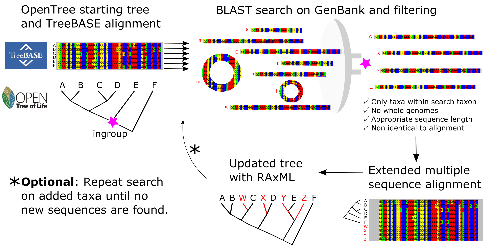

# Introduction

Phylogenies capture the shared history of organisms and provide key evolutionary context for our biological observations.
Public biological databases constitute an amazing resource for evolutionary studies. Updating existing phylogenies with molecular data that has never been incorporated into any phylogenetic estimate, geographical location, fossils, and other data in a reproducible and continuous manner is possible by establishing a data interoperability framework for biological databases. Here, we introduce Physcraper, a tool that automates database connections to build upon homology hypotheses that taxon specialists have assessed and deemed appropriate for a specific phylogenetic scope to update a starting tree and single locus alignments with public DNA data.

Taxonomic idiosyncrasies across databases represent a huge challenge for automatic integration of data into phylogenies, which can be addressed with a unified taxonomy for name standardization. The Open Tree of Life project (OpenTree)
<!-- [project](https://opentreeoflife.github.io/)  -->
constructs a comprehensive tree of life by synthesizing published phylogenies and taxonomy. OpenTree's "synthetic" tree comprises 2.3 million tips, of which around 90,000 are supported by phylogenies - the remaining 1.4 million taxa are placed in the tree based on taxonomy. To achieve this, OpenTree unifies taxonomic data from various databases [@rees2017automated], including the USA National Center for Biodiversity Information (NCBI) molecular database GenBank [@benson2000genbank], among others. The OpenTree taxonomy represents a key resource for connecting data from any biological database that has been integrated to it.
<!-- to phylogenetic data that has been standardized to it. -->

Another challenge for incorporating public molecular data into existing phylogenies is assembling high-quality homology hypotheses.
While genomics has, and will continue to, revolutionize phylogenetic inference, the variety of alternative genomic sequencing approaches it uses produce largely non-overlapping genomic datasets across taxa, creating challenges in wide scale phylogenetic reconstruction.
<!-- Also, as @andermann2020guide point out, "assembling full genomes is often unnecessary for phylogenomic studies if the main goal is to retrieve an appropriate number of phylogenetically informative characters from several independent and single-copy genetic markers [@jones2016targeted]." -->
Phylogenomics ameliorate this problem by focusing on targeted capture of informative loci [@andermann2020guide]. Yet, decades of single locus sequencing have generated massive amounts of homologous DNA datasets that can be used for phylogenetic reconstruction at many scales.
<!-- Moreover, species tree reconstructions from multiple single locus datasets using the multispecies coalescent model are considered the gold standard for inferring species relationships [@song2012resolving]. -->

More than a decade ago, GenBank release 159 (April 15, 2007) already hosted 72 million DNA sequences that were gauged to have the potential to resolve phylogenetic relationships of `r round(236023/240708, digits=4)*100`% of the almost 241,000 distinct taxa in the NCBI taxonomy at the time [@sanderson2008phylota]. Assembling a DNA alignment from such a massive database can be done "by hand", but it is a largely time consuming and mostly non-reproducible approach. Computational pipelines that mine DNA databases fast, efficiently, and reproducibly, have been applied to infer phylogenetic relationships in a variety of organisms [e.g., @smith2009mega; @antonelli2017toward; @izquierdo2014pumper].
<!-- *maybe a box of all pipelines?* -->
However, fine-grained curated markers and alignments can improve phylogenetic reconstructions, even in phylogenomic analyses [@fragoso2017pilot].

There are almost 8,200 publicly available, peer-reviewed alignments, covering around 100,000 distinct taxa in the TreeBASE database [@piel2009treebase], which can be used as seeds to mine molecular databases, and as "jump-start" alignments for phylogenetic reconstructions [@morrison2006multiple] to continually enrich, update and compare existing phylogenetic knowledge.

<!-- Linking expert alignments with molecular data that has not yet been included in any public phylogenetic estimate has the potential to accelerate the enrichment and updating of phylogenetic relationships in many regions of the tree of life. -->

Physcraper is a Python pipeline using OpenTree's taxonomy and programmatic access protocols (API's) to implement a database interoperability framework that automatically links phylogenies that have been standardized to OpenTree taxonomy, to alignments from TreeBASE, data from GenBank, and phylogenies from OpenTree's Phylesystem.
Physcraper aims to demonstrate the benefits of reproducible workflows and open science in phylogenetics, and encourage better data sharing practices in the community.

# The Physcraper framework

```{r framework, echo=FALSE, fig.cap="The Physcraper framework consists of 4 steps (see text). The software is fully described on its documentation website at physcraper.readthedocs.io, along with installation instructions, function usage descriptions, examples and tutorials.", out.width = '85%', fig.retina= 2, fig.align = "center"}
# knitr::include_graphics("https://raw.githubusercontent.com/McTavishLab/physcraper/pyopensci/docs/img/schematic.svg")

```

The general Physcraper framework consists of 4 steps (Fig. \@ref(fig:framework)): 1) identifying and processing a tree and its underlying alignment; 2) performing a BLAST search of DNA sequences from original alignment on GenBank, and filtering of new sequences; 3) profile-aligning new sequences to original alignment; 4) performing a phylogenetic analysis and comparing the updated tree to existing phylogenies.

## The inputs: a tree and an alignment

Taxon names in the input tree must be standardized to OpenTree taxonomy [@rees2017automated] using OpenTree's bulk Taxonomic Name Resolution Service [TNRS](https://tree.opentreeoflife.org/curator/tnrs/) tool. Users can upload their own tree, or choose from among the 2, 950 standardized trees stored in OpenTree's [Phylesystem](https://github.com/opentreeoflife/phylesystem) that also have alignments available on TreeBASE [@piel2009treebase].

The input alignment is a single locus DNA dataset that was used in part or in whole to generate the input tree. Physcraper retrieves TreeBASE alignments automatically. Alternatively, users must provide the path to a local copy of the alignment.
<!-- Alignments stored in any other repository, or constituting personal data have to be stored locally. -->
Only taxa that are both in the sequence alignment and in the tree are considered further for analysis; at least one taxon and its corresponding sequence are required.

## DNA sequence search and filtering

The Basic Local Alignment Search Tool, BLAST [@altschul1990basic] is used for DNA sequence search on a remote or local GenBank database. It is constrained to a "search taxon", a taxonomic group in the NCBI taxonomy that is automatically identified using the OpenTree [API](<https://github.com/OpenTreeOfLife/germinator/wiki/Taxonomy-API-v3#mrca>) [@rees2017automated], as the most recent common ancestor of ingroup taxa that is also a named clade in the NCBI taxonomy (Fig. \@ref(fig:framework)).
  <!-- FIGURE RECOMMENDED: Figure \@ref(fig:search)  -->
<!-- The MRCAT can be different from the phylogenetic MRCA when the latter is an unnamed clade in the synthetic tree.  -->
Alternatively, users can arbitrarily define a search taxon that is either a more or less inclusive clade relative to the ingroup taxa.


BLAST is implemented with the `blastn` function [@camacho2009blast] and the BioPython [@cock2009biopython] BLAST function from [NCBIWWW module](https://biopython.org/DIST/docs/api/Bio.Blast.NCBIWWW-module.html) modified to accept an alternative BLAST address.
Each sequence in the alignment is BLASTed once against all DNA sequences in GenBank.
New sequences are excluded for analysis if they 1) are not in the search taxon; 2) have an e-value above the cutoff (default to 0.00001); 3) fall outside a min and max length threshold, defined as the proportion of the average length without gaps of all sequences in input alignment (default values of 80% and 120%, respectively); 4) or if they are either identical to or shorter than an existing sequence in the input alignment and they represent the same taxon in OpenTree or NCBI taxonomy.
An arbitrary maximum number of randomly chosen sequences per taxon are allowed (default to 5).

Reverse, complement, and reverse-complement sequences are identified and translated using BioPython internal functions [@cock2009biopython].
Iterative cycles of BLAST searches can be performed, by blasting all new sequences until no new ones are found. By default only one BLAST cycle is performed.
<!-- in which only sequences in the input alignment are BLASTed. -->


## New DNA sequence alignment

MUSCLE [@edgar2004muscle] is used to perform a profile alignment in which the original alignment is used as a template of homology criteria to align new sequences.
The final alignment is not further automatically checked, and additional inspection and refinement are recommended.

## Tree reconstruction and comparison

RAxML [@stamatakis2014raxml] is implemented to reconstruct a Maximum Likelihood (ML) gene tree for each input alignment with default settings (GTRCAT model and 100 bootstrap replicates with default algorithm), using input tree as starting tree for ML searches.
Bootstrap results are summarized using DendroPy's SumTrees module [@sukumaran2010dendropy].

Physcraper's main result is an updated phylogenetic hypothesis for the search taxon.
Updated and original tree are compared with Robinson-Foulds weighted and unweighted metrics estimated with Dendropy [@sukumaran2010dendropy], and with a node by node comparison between the synthetic OpenTree and original and updated tree individually, using OpenTree's conflict API [@redelings2017supertree].
<!-- For the conflict analysis to be meaningful, the root of the tree needs to be accurately identified. The best way to currently do this is by hand, although a default rooting based on OpenTree's taxonomy is also available. -->
<!-- It uses the taxon labels for all the tips in the updated tree, pulls an inferred subtree from OpenTree's taxonomy and then applies the same rooting to the inferred updated tree. However, if the updated tree changes expectations from taxonomy, the rooting may no longer be appropriate. Automatic identification of a phylogenetic tree root is a difficult problem that has not been solved yet. The best way is to define the outgroup directly on the updated tree as part of the conflict analysis, so trees are accurately rooted. -->
<!-- *It would be a nice addition to have users give the output of the input tree as an argument at some point, or maybe we could add a super outgroup at random based on the search taxon* -->


# Case Study: The hollies

A user is interested in phylogenetic relationships within the genus *Ilex*. Commonly known as "hollies", the genus encompasses between 400-700 living species, and is the only extant clade within the family Aquifoliaceae, order Aquifoliales of flowering plants.

An online literature review in June 2020 (Google scholar search for "ilex phylogeny") reveals that there are several published phylogenies showing relationships within the hollies [@cuenoud2000molecular; @manen2010history; @setoguchi2000intersectional; @selbach2009new], but only two have data publicly available [@gottlieb2005molecular; @yao2020phylogeny].
@gottlieb2005molecular made original tree and alignment available in [TreeBASE](https://treebase.org/treebase-web/search/study/summary.html?id=1091). The "Gottlieb2005" tree sampling 41 species was added to [OpenTree Phylesystem](https://tree.opentreeoflife.org/curator/study/edit/pg_2827/?tab=home) and it has been integrated into [OpenTree's synthetic tree](https://devtree.opentreeoflife.org/opentree/opentree12.3@mrcaott68451ott89474/Ilex-theizans--Ilex-dumosa).

The most recent *Ilex* tree [@yao2020phylogeny] is available in [OpenTree Phylesystem](https://tree.opentreeoflife.org/curator/study/view/ot_1984) and in the [DRYAD repository](https://datadryad.org/stash/dataset/doi:10.5061/dryad.k0p2ngf4x). With 175 tips, the "Yao2020" tree is the best sampled phylogeny yet available for the hollies.

We ran Physcraper on a laptop Linux computer to update an internal transcribed spacer DNA region (ITS) alignment from @gottlieb2005molecular, using a local GenBank database.  BLAST and RAxML analyses ran for 19hrs 45min, with bootstrap analyses taking an additional 13hrs.
<!-- **MTH: you probably need some details about the hardware, given the fact that you are discussing running times** -->
The updated Gottlieb2005 tree (Fig. \@ref(fig:results)) displays all 41 distinct taxa from the original study plus 231 new tips, contributing phylogenetic data to 84 additional *Ilex* taxa. The best RaxML tree is 99% resolved, with 25% of nodes with bootstrap support < 0.1 and 48% nodes with bootstrap support > 0.75.
A large portion of internal branches are negligibly small, with 30 branches < 0.00001 substitution rate units, from which only 9 have a bootstrap support > 0.75 (Fig. \@ref(fig:results)).
For comparison, Yao2020 also contains all 41 distinct taxa from the original Gottlieb2005 study,
<!-- has less new tips (134), but  -->
and contributes phylogenetic data to 134 additional *Ilex* taxa, from which
`r 135-68` are also in updated Gottlieb2005. While @yao2020phylogeny also used ITS as a marker, their GenBank data is not released yet, so Physcraper was unable to incorporate 68 additional taxa into the analysis. However, Physcraper was able to incorporate 18 taxa that were not in Yao2020.
<!-- **Any statements about relationships or anything? Are there multiple seqs for these taxa?**
add 1 sentence saying that it is odd that we are getting differnet relationships given what is likely to be the same data
but we can't compare the exact seqs or alignemnt, bc they are not available.
 -->
<!-- This might be caused by the method they used to download existing ITS *Ilex* sequences from GenBank, which is not fully explained in the publication, but seems to be a "manual" process. -->
<!-- More Physcraper examples at a range of taxonomic scales are available in the Physcraper documentation online. -->
<!-- The alignments have THIS MANY columns and THIS AMOUNT of missing data. -->
<!-- RF DISTANCE INTERPRETATION -->
<!-- ADD ML ESTIMATES OF UPDATED TREE VS ORIGINAL TREE ?-->

<!-- ```{bash echo= FALSE, include=FALSE, message= FALSE, results='hide'}
wget -O docs/figs/ilex-plot-tips-and-branches-1.png https://raw.githubusercontent.com/McTavishLab/physcraperex/master/docs/articles/ilex_files/figure-html/plot-tips-and-branches-1.png
``` -->

```{r results, echo=FALSE, fig.cap="A) Phylogeny updated with Physcraper from Gottlieb et al. 2005 tree in B.", out.width = '100%', fig.retina= 2}

# knitr::include_graphics("docs/figs/ilex-plot-tips-and-branches-1.png")
knitr::include_graphics("../docs/figs/ilex-results.png")

```


\newpage

*Figure \@ref(fig:results) caption continued*: Tips in original alignment and new tips added with Physcraper are depicted in black and red, respectively. Physcraper obtained sequences from the GenBank database via local BLAST of all sequences in the original alignment that generated tree in B), filtered them following criteria from section "DNA sequence search and filtering", aligned them to original alignment using MUSCLE and performed a phylogenetic reconstruction using RAxML with 100 bootstraps. B-D conflict analyses performed with OpenTree tools.


# Discussion

Databases preserving and democratizing access to biological data
have become essential resources for science.
New molecular data keep accumulating and tools facilitating its integration into existent evolutionary knowledge are needed.

Phylogenetic pipelines designed to make evolutionary sense of the vast amount of public molecular data (e.g., Phylota [@sanderson2008phylota], PHLAWD [@smith2009mega], SUPERSMART [@antonelli2017toward]) focus on generating full phylogenies *de novo*, i.e., inferring phylogenetic relationships from a newly generated homology hypothesis, as opposed to e.g., supertrees, that are generated by summarizing previous phylogenetic estimates.
While Physcraper does not generate phylogenies *de novo* in a traditional sense,
it successfully generates new phylogenetic knowledge, revealing the importance of
open science in facilitating phylogenetic placement of public molecular data and accelerating enrichment and updating of phylogenetic relationships in any region of the tree of life.
The PUMPER pipeline [@izquierdo2014pumper] also uses the concept of updating
pre-existing alignments to incorporate public molecular data into phylogenies. Unfortunately, installation was unsuccessful following instructions from the author, and a comparison analysis was unfeasible.
<!-- **MTH: add some more details about what aspect of the PUMPER install failed** -->

Physcraper generates individual gene trees, failing to capture the complexity of species' evolutionary history [@song2012resolving]. Yet, Physcraper facilitates gathering alignments and gene trees for multiple loci from a group of interest, that can be used to reconstruct species trees with ASTRAL [@mirarab2014astral], BEAST2 [@bouckaert2019beast], or SVD Quartets [@chifman2014quartet]).

Physcraper can potentially link phylogenies to data available in any of the taxonomies integrated in the OpenTree taxonomy [@rees2017automated], such as geographical locations from the Global Biodiversity Information Facility, or fossils from the Paleobiology Database.
<!-- a resource that is contributing to achieve the goal of "exploring and analysing biodiversity at an accelerated pace, and returning systematics into the mainstream of science" [@wilson2003encyclopedia]. -->
The Physcraper workflow can be used to rapidly (in a matter of hours)
address challenges overarching both fields of ecology and evolution, such as
placing newly discovered species phylogenetically [@webb2010biodiversity],
systematizing molecular (and other) databases, i.e., curating taxonomic assignations [@san2010molecular],
and generating custom trees for ecological [@helmus2012phylogenetic] and evolutionary downstream analyses [@stoltzfus2013phylotastic].

Data repositories hold more information than meets the eye.
Beyond the main data, they are rich sources of metadata that can be leveraged for the advantage of all areas of biology as well as the advancement of scientific policy and applications.
Initial ideas about the data are constantly changed by results from new analyses.
Physcraper provides a framework for reproducible phylogenetics that has the potential to consistently provide context for these ideas, highlighting the importance of data sharing and open science in the field, biology and science.

# Acknowledgements

Research was supported by the grant "Sustaining the Open Tree of Life", NSF ABI No. 1759838, and ABI No. 1759846.
Computer time was provided by the Multi-Environment Research Computer for Exploration and Discovery (MERCED) cluster from the University of California, Merced (UCM), supported by the NSF Grant No. ACI-1429783.

We thank the members of the OpenTree development team and the "short bar" Science and Engineering Building 1, UCM, joint lab paper discussion group for valuable comments on this manuscript.

The authors have no conflict of interest to declare.

# Authors' Contributions

LLSR wrote manuscript, alignment code, documentation, performed analyses and developed examples; MK wrote code for ncbidataparser module, filtering of sequences per OTU and using offline blast searches, wrote documentation and tests; EJM conceived study, wrote most of the code, documentation and tests.
All authors contributed to the manuscript and gave final approval for publication.

# Data Archiving

Physcraper source code: https://github.com/McTavishLab/physcraper

Documentation: https://physcraper.readthedocs.io/en/latest/index.html

Examples: https://github.com/McTavishLab/physcraperex

Reproducible manuscript: https://github.com/McTavishLab/physcraper_ms

# References
